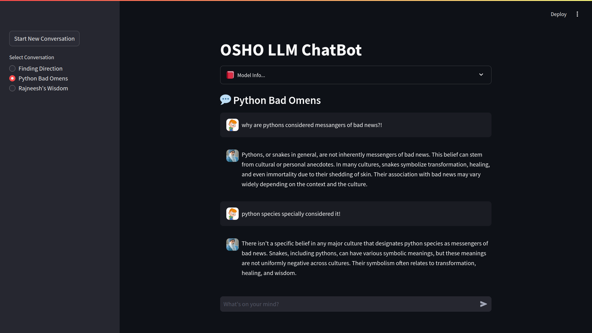

# AI-ChatBot

An Intuitive AI-ChatBot with HuggingFace and LangChain impersonating Rajneesh OSHO, a great mystic.

AI-ChatBot is a simple AI-ChatBot leveraging **HuggingFace** inference endpoint and **LangChain**
to generate text based on input prompts. It supports **multi-thread conversations** for single user &
**`LangGraph's persistent memory`** for contextual & intuitive responses.

It currently uses ***in-memory*** storage, so volatile for single run!

## Images

**Streamlit UI**

<div>
   <br>
   
   
</div>


## Components Used

- 🐍[Python 3.10+](https://www.python.org/downloads/) - You know the beast 😇
  
- 🦜⛓️ [LangChain](https://langchain.com/) (with [LangGraph](https://www.langchain.com/langgraph)) - Framework for LLM Applications development & orchestration.
  
- 🤗 [HuggingFace](https://huggingface.co/) (with [HuggingFace Inference API](https://api-inference.huggingface.co/)) - A library for natural language processing tasks and API for model inference.
  
- 👑 [Streamlit](https://streamlit.io/) - A framework for building web applications for machine learning and data science.


## How to Use Locally

> [❌] Currently in development - **DO NOT TRY TO USE LOCALLY** - Won't work till I update the instructions.
>
> **! Working on Architectural changes.**

1. **Clone the repository**:
   ```bash
   git clone https://github.com/DarkDk123/AI-ChatBot
   cd AI-ChatBot
   ```

2. **Set up a virtual environment**:
   ```bash
   python3 -m venv .venv
   source .venv/bin/activate
   ```

3. **Install dependencies**:
   ```bash
   pip install uv # It's fast
   uv pip install -r requirements.txt
   ```

4. **Configure environment variables**:
   Create a `.env` file and add your HuggingFace token and model ID. (see [`.env.example`](.env.example))
5. **Run the Streamlit app**:
   ```bash
   streamlit run main_streamlit.py
   ```

6. **Access the service**:
   Open your browser and navigate to **`http://localhost:8501`** to access the **AI-ChatBot** Service.
